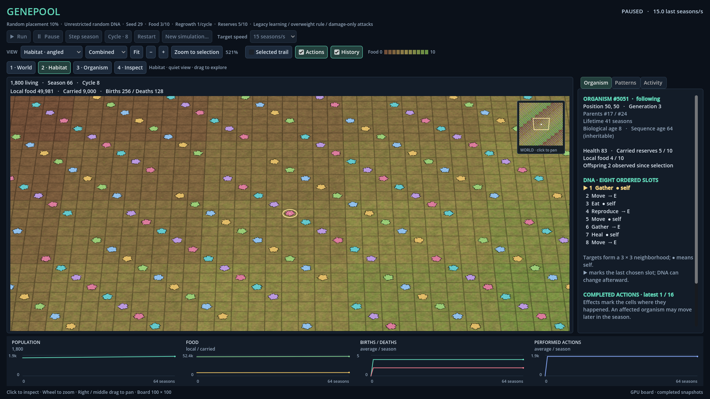
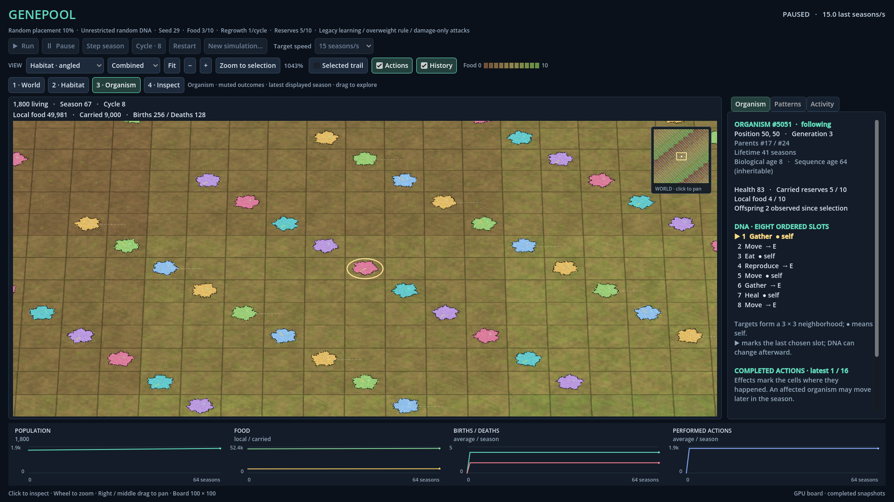
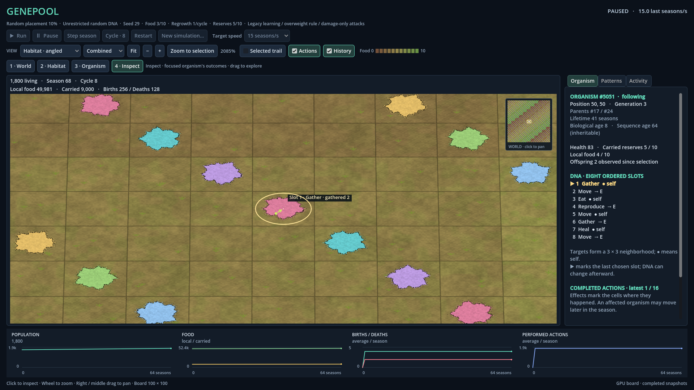

# R03 Step 4 — Living habitat view

Genepool Analyzer · 2026-09-08T01:54:13.964569+00:00 · **Implemented and verified; awaiting owner review.**

The owner explicitly started Step 4: “Good! You can start now with step 4. I am off to sleep. I will see what you did in the morning :D”. This implements the accepted design direction (DEC-0031), including navigation and both action-detail scopes. Step 5 polish, standalone export and the deferred food-growth cycle remain later work. No ecological trial or iteration closure is claimed.

## What changed

- A genuine Godot 3D viewport with top-down and gently angled orthographic cameras over a shallow flat board. The earlier Godot 2D renderer remains selectable on the same running world; the Windows Forms app remains a separate startup project in the unchanged solution.
- Brown dirt through olive to green represents the existing food quantity, with ground grain and small grass fans at closer scales. Fuzzy, irregular mould colonies replace small squares in the new view. Decorative colony shape follows identity through movement. Colors improve contrast and group patterns, with a finite palette rather than a unique DNA/species claim. Materials are procedural GPU code; no new artwork package, engine installation or dependency was needed.
- Smooth mouse zoom plus four named presets: World, Habitat, Organism and Inspect. Right/middle dragging, a clickable minimap, Fit and Zoom to selection support navigation. Only visible cells are submitted at close scales; the crop has no artificial world rim. Only true world boundaries get an edge.
- Level 3 displays muted actual outcomes throughout all relevant visible cells. Level 4 displays full outcomes only for the explicitly focused organism. The entire latest completed season's observed cohort is detached into the frame, replacing the batch each season; there is no 64-actor or nearest-neighbor cap in this new feed. Existing 2D markers remain unchanged.
- Cues distinguish movement, failed attempts, gathering, reserve consumption, healing, damage, confirmed DNA changes and actual child placement. Birth coordinates and identity come from the placement callback, separately from the mate/self target. Paused outcomes remain inspectable; running cues expire without being replayed by same-season acknowledgments. A deceased selection remains a historical location, without selecting its replacement. Target effects describe the cell at action time, since affected organisms may move later in the season.
- The inspector explains detail levels, biological units and actual effects. It labels unavailable before-state resource changes rather than asserting measured zero deltas. The existing selected history stays bounded to sixteen observations.

Simulation rules, scheduling, policies, random draws and the deferred grow/grow/hold/decay request were not changed. Observation itself has a measured cost described below. The new view does not claim to accelerate simulation calculations.

## Actual rendered previews

These are screenshots of the implemented viewer on detached **synthetic review fixtures**, not generated mockups or ecological results. The control buttons are disabled because these preview fixtures own no simulation. Normal startup has the live controls.

## Verification

| Check | Result |
| --- | --- |
| Whole-solution Visual Studio 2022 Debug rebuild | PASS, 0 errors; 106 existing CA1416 warnings |
| Whole-solution Visual Studio 2022 Release rebuild | PASS, 0 errors; 106 existing CA1416 warnings |
| Console suite, Debug | 159/159 PASS; 68.27 s |
| Console suite, Release | 159/159 PASS; 60.75 s |
| New depth GPU checks | 106 PASS, no engine errors |
| New depth headless checks | 94 PASS, no engine errors |
| Retained original 2D GPU/shared-controls suite | 62 PASS, no engine errors |
| New renderer benchmark | 12/12 coverage/budget checks PASS |

New regressions cover a cohort beyond 64 actors, published-frame immutability, partial/completed boundaries, acknowledgments, reset, real movement and fallback destinations, blocked movement, mutations, no-choice death, actual self/partner birth placement, newborn timing and deterministic full-state/RNG passivity. The extra observer-cost case measures rather than imposes a machine-specific timing threshold. Debug assembly identities still match the passing suite after the later renderer-only rebuild.

Godot checks exercise both depth cameras and all four levels, visible-cell counts, true/interior world edges, picking after zoom/pan/resize, all-visible versus focused action scopes, stale/expired outcomes, dead-selection replacement, stable appearance, minimap navigation, material pixels and actual injected mouse input. Layouts were checked at 1366×768 and 1920×1080. The live worker check uses a real selected organism, preserves paused state and RNG across view changes, advances one season and shuts down. Headless navigation proves handler/geometry behavior; GPU checks separately establish rendered pixels and injected Godot input. Physical mouse-to-photon latency, a physical DPI/monitor transition and IDE breakpoint interaction were not measured.

## Renderer performance and the repaired slowdown

Measured on **AMD Radeon RX 6800**, Godot 4.7.2-stable (official) Compatibility rendering, 1920×1080, 60 FPS cap. Each workload has 3 s warmup and 7 s sampling, with 70/70 requested 10 Hz snapshots delivered and no skipped sample updates. Main-loop intervals include fixture replay and UI work; they exclude simulation calculation and are not hardware presentation measurements.

| World population | Detail | Visible organisms | Visible actions | FPS | p95 frame interval |
| --- | --- | --- | --- | --- | --- |
| 0 | World (L1) | 0 | 0 | 60.0 | 16.68 ms |
| 1,000 | World (L1) | 1,000 | 0 | 60.0 | 16.68 ms |
| 10,000 | World (L1) | 10,000 | 0 | 60.0 | 16.68 ms |
| 10,000 | Organism (L3) | 364 | 364 | 60.0 | 16.69 ms |

The first dense L3 implementation naturally failed its 33.3 ms p95 budget: 54.16 FPS, 42.94 ms p95 and 58.48 ms maximum, while still displaying 364 visible actions. It issued many separate drawing calls and repeatedly accessed native projection properties. The repair batches all muted line geometry by color and caches projection data once per redraw. The same workload now reports 60.00 FPS and 16.69 ms p95, preserving all 364 cues. No test threshold or spatial coverage was weakened. Level 4 retains detailed focused geometry.

## Observation cost

The controlled 10,000-organism Move/Self workload completed 2/2 pairs in Release (4.82 s total). It uses serial deterministic execution, alternating pair order, 3 warmup plus 5 measured seasons per run and a 10 s cooperative bound. Occupancy stays full. Both complete pairs preserve the compact cell/organism/gene/RNG digest; learning internals are covered by the separate full-state passivity regression, not this cost digest.

- Pair 1: observer-on versus completely observer-off mean season difference 8.34 ms (6.5%); separate capture 3.35 ms; additional season allocations 2.14 MiB; capture allocations 0.46 MiB.
- Pair 2: observer-on versus completely observer-off mean season difference 26.69 ms (25.3%); separate capture 3.17 ms; additional season allocations 2.14 MiB; capture allocations 0.46 MiB.

This comparison includes **all collector work versus no collector at all**. It is not a measured regression against the previous viewer's collector. It covers a simple full-board workload, not mixed actions or long learning histories; percentages include host/JIT/GC variation. Capture timing is separate from season calculation. The complete Debug and Release measurements are retained in their current result files.

## Build recovery and evidence horizon

The first sandboxed VS build could not read NuGet's user-settings location during Godot SDK resolution. Running the already-authorized build with host access resolved that environment restriction. The first compiled viewer then exposed an incorrect Godot enum member, corrected against the installed API, and a hiding warning, corrected by renaming the helper. The first sandboxed GPU run passed its internal checks but reported a certificate-store access error at shutdown; host execution completed without that error. These natural failures were not counted as clean end-to-end passes.

Implementation started from local Git **14b39d984555897e88c279ed21651df7c114e05d**, with an initially clean tracked tree. The exact previous registered source bytes were checked before edits. Git reproduced the affected code/doc predecessors except the registered Tests Program/README versions, for which the smallest exact source snapshots were retained under KB/source-history. Source revisions preserve old identities and locators. The existing SRC-0115 historical-byte warning is unrelated and remains disclosed. No commit or push was performed.

Genepool Analyzer integrated and reviewed bounded transient helper contributions for the renderer, observation feed, independent action audit and verification. The root performed all builds and test runs. Installed SDK9.0.315, net9 targets, project mappings and launch profiles remain unchanged. Godot's installed native host reports .NET 10.0.9; this does not change the solution target.

Current evidence: [builds](r03_step4_builds.json), [Debug tests](r03_step4_tests_debug.json), [Release tests](r03_step4_tests_release.json), [GPU](r03_step4_verification.json), [headless](r03_step4_headless.json), [benchmark](r03_step4_benchmark.json), and [original 2D](r03_godot_verification.json). KB transaction, receipt and final validation are r03_step4_transaction.json, r03_step4_receipt.json and r03_step4_validation.json. Current reports replace routine test history; no backup tree or historical test archive was created.

## Owner review and stop

Open the entire solution in Visual Studio 2022, build Debug and start the existing Genepool Godot profile. Try Habitat, Organism and Inspect; select a life, step a season, pan with the right/middle button and navigate with the minimap. Compare angled/top-down and Original 2D. The code is ready for this review; owner acceptance is pending. Work stops at Step 4. Step 5 polish, standalone packaging and deferred food mechanics await their own next instruction.
