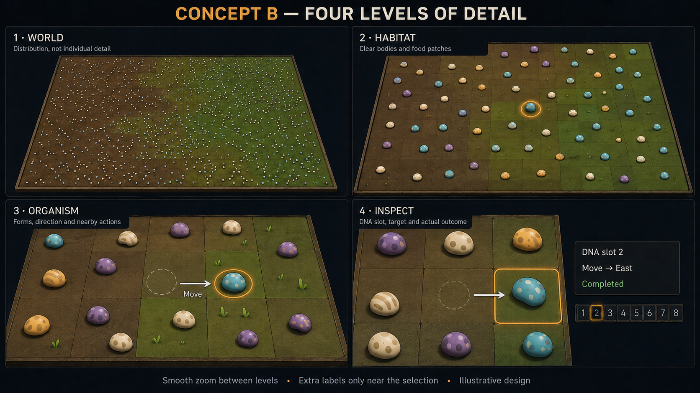
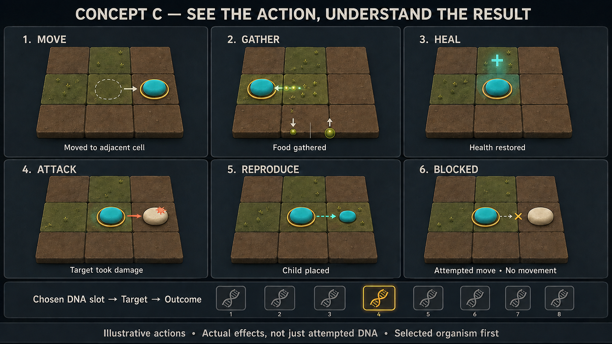

# R03 Step 4 — A clearer living board

Genepool Analyzer · 2026-09-08 · **Design revision 2 accepted by the owner (DEC-0031); implementation remains unstarted.**

Acceptance update: after reviewing the updated Habitat, Organism and Inspect mockups, the owner said, “Ok this looks good for now. We can improve on this later. Accepted. Whats next?” This accepts the current design as a working direction, with later refinement allowed. The next proposed work is Step4 implementation in the increments below; the current message asks for the next step and does not start coding.

Owner decisions: DEC-0029 selects the mould-like organism appearance. DEC-0030 approves grass/dirt appearance and specifies viewport-only drawing at levels 2–4, real board borders only, muted actions throughout the visible cells at level 3, and full action detail only for the focused organism at level 4. These are design decisions; the earlier no-code boundary remains in force.

The owner starts Step 4 design work and explicitly requests visual examples before coding. The proposed direction is a modest 3D board with top-down and gently angled camera presets, four levels of visible detail, and short action cues. The existing simulation and Visual Studio 2022 solution remain the foundation. R03 Step 3 is accepted; Step 5's final artwork and standalone packaging remain later work. The seasonal food-growth request stays deferred under DEC-0027.

## What the current view tells us

The inspected 100 × 100 board renders an organism at one-third of a cell's width in combined mode. Food occupies the whole cell. Organism RGB values come directly from the ordered action-type code and can blend into the background; that last point is a design inference, consistent with the owner's visibility complaint. Food currently runs from dark blue-gray `#111C25` to green `#74BC88`. Current zoom is continuous, from 1× to 12×; cell borders appear at 15 pixels per cell, but there are no separate organism detail representations.

Sources: [BoardView2D.cs](../Fistnet.Genepool.Godot/BoardView2D.cs), `UploadFrame`, `ZoomAt`, overlay drawing; [BoardPresentation.cs](../Fistnet.Genepool.Control/Presentation/BoardPresentation.cs), `FoodArgb`, `OrganismArgb`; [ViewCollector.cs](../Fistnet.Genepool.Control/ViewCollector.cs), `PatternCode`, `Capture`. These are static findings, not a new runtime test.

## A. Board appearance and layout

The board gets most of the window. A compact inspector remains on the right; population/food/activity charts can expand when needed. A small minimap with a viewport rectangle, Fit and Zoom to selection keep a close view navigable. At levels 2–4, draw only the visible board area and clip naturally at the viewport; the visible crop is not a separate miniature board. A brief mouse-drag hint and a grab cursor make panning discoverable.

Draw a board-edge line, rim or outside-board background only at the actual world boundary. Do not draw an artificial rim, drop shadow, cliff or perimeter around an interior camera crop or rendering chunk. Partial cells at the viewport edge should look cut off by the window, making continuation apparent. Panning changes the view, not cell coordinates, population, food or the simulation's extent. This also applies in the angled view.

- **Organisms:** owner-preferred flat mould-like colonies, approximately 55–75% of cell width at useful close scales, with irregular lobes, branching filaments and pale fuzzy edges. Simplify filaments at distance while preserving recognizable occupied cells and color contrast. This replaces rounded pebbles/domes; see the [appearance decision](R03_STEP4_MOULD_DIRECTION.md). Shape and color are visual aids, not new biological traits or fixed predator/prey species. A limited display palette cannot uniquely identify every DNA pattern: exact pattern keys, selection and the inspector remain authoritative. A palette mapping would need explicit labels and consistent pattern highlighting.
- **Food:** the grass/dirt appearance is owner-approved: earthy brown → olive → green, using the existing quantity 0–10. Initial palette swatches remain design approximations: `#6B4934`, `#8B6A42`, `#8A8748`, `#769657`, `#6DAA64`. The numeric legend stays available. Short sprouts or a low ground covering appear only close up and only in proportion to food quantity. Their geometry is presentation, not a new plant simulation. Changing this palette does not implement the deferred growth/hold/decay cycle.
- **Depth:** a flat board with shallow bodies and modest shading. Offer top-down and angled orthographic presets; retain the current 2D view as a selectable fallback. Do not add obstacles or terrain heights that imply changed movement rules. Body silhouettes must stay inside their cells and remain selectable at the angled camera's far edge.
- **Quiet background:** no dense labels or individual health bars on the full board. Interior cell seams fade in with zoom; only the true world edge gets an outer border. The approved grass/dirt concept guides appearance; generated textures are not a promise of identical production artwork or measured performance.

## B. Four levels of detail

This earlier storyboard illustrates increasing detail. Its rounded bodies and mini-board rims are superseded by DEC-0029/DEC-0030: use mould-like colonies and a naturally clipped continuous board at levels 2–4.

Keep smooth wheel zoom and cursor anchoring, with four named presets. Detail changes progressively; it does not jump between four separate worlds. Selection, cell identity, view center and simulation time stay consistent. Fit remains the full-world view; a prominent Habitat preset and Zoom to selection make the useful closer views easy to reach.

| Level | Main purpose | Visible detail |
|---|---|---|
| **1 — World** | See distribution, gaps and food availability | Small high-contrast dots; broad food color; selection locator. No ground texture, cell seams, action text or individual bars. |
| **2 — Habitat** | Watch a neighborhood | Visible area only; readable mould silhouettes and food coverage. Quiet action display remains the proposed default; retain selection and panning cues. |
| **3 — Organism** | Follow visible behavior | Visible area only; muted, short action cues for every visible cell with an observed action. Use low emphasis, small glyphs and short links rather than selecting only a subset of visible organisms. No numeric/text flood. |
| **4 — Inspect** | Understand the focused organism | Visible area only; full action cues exclusively for the focused organism, with DNA slot, target, outcome, action-specific amounts and recent history. Other organisms remain visible but their action effects are suppressed. An affected target can be highlighted as part of the focused organism's action. |

Provisional transition thresholds are based on projected cell size, not arbitrary magnification: under 12 logical pixels, 12–32, 32–72, and 72 or more, using the shorter projected cell dimension in the angled view. These are implementation starting points to tune at 1366×768 and 1920×1080, not accepted measurements. Blend visual detail across a small threshold range to avoid flicker while zooming. Extra markers must not obscure neighboring cells.

## C. DNA actions visible on the board

Use one readable vocabulary: **chosen DNA slot → intended target → actual result**. The owner now defines action scope by zoom level: level 3 covers all visible cells with muted cues; level 4 gives full detail only to the focused organism. This replaces the earlier Selected-default/optional-Nearby proposal. An optional master Off switch can remain, but the ordinary level-3 display must not silently become selected-only or an arbitrary neighborhood subset.

Treat focus as the explicitly selected/pinned organism, consistent with the current inspector; hovering should not silently change it. With no focus at level 4, show a quiet “Select an organism to inspect actions” hint. The bodies and food remain visible. An empty cell or organism with no observed action gets no invented activity.

| Action/outcome | Proposed cue |
|---|---|
| Successful move | Brief old-position outline and a short link to the actual new cell; the solid body stays at its completed position. |
| Gather local food | A few motes from the source food into reserves; any numeric amount comes from the recorded transfer. |
| Eat reserves | A small carried-food cue, distinct from gathering food off the board. |
| Heal | Short plus-sign pulse; report recorded healing separately from total season health change. |
| Attack | Short directional hit cue on the affected target. Damage, failed attack and death must not be conflated. |
| Reproduce | Brief appearance ring on the actual placed child and a temporary parent-child cue where observed identity/placement supports it. Smaller size in the image depicts appearance animation, not a new offspring-size rule. |
| Blocked or ineffective action | Dashed target indicator and a muted cross/status. No successful movement, damage or birth animation. |
| Mutate / Infect | A DNA-change cue only when a confirmed outcome supports it. Exact changed slots or mutation counts need additional observed data; do not infer them from choosing the gene. |

Current data already includes the selected organism's last 16 completed action observations since selection: chosen slot, target, result, movement coordinates and several action-specific effect fields. It does **not** include detailed action/health data for every world organism. Global markers currently contain only location and kind, capped at 64; publication can skip seasons. Sources: [ViewFrame.cs](../Fistnet.Genepool.Control/ViewFrame.cs), `ViewCell`, `ViewAction`, `ViewOrganism`; [ViewCollector.cs](../Fistnet.Genepool.Control/ViewCollector.cs), `ActorCompleted`, `Marker`, `Select`.

Level 3 therefore requires a new bounded, detached observation feed from the existing completion hook as part of the eventual implementation. Its spatial coverage is the entire visible viewport, including actions whose source, destination or affected target intersects that area. Clip cues at the viewport edge without inventing offscreen positions or a boundary. Capture real events first, then apply focus/visibility rules; panning must not change simulation decisions or random draws.

Bound retained time rather than silently dropping an arbitrary subset of visible cells: retain the displayed completed season's relevant action outcomes and replace obsolete batches. A finite board and per-season actor count provide a bounded starting point; exact representation and cost must be verified during implementation. Do not assume one event per cell when movement or births can place multiple events there. At fast playback, season sampling may remain explicit, but a presented season should provide spatial coverage across all visible cells; do not call a cell-filtered sample “all visible actions.” If performance becomes a problem, simplify cue geometry, opacity and labels first. Any unavoidable omission must be disclosed and resolved against this requirement, not hidden in an event cap.

Use a short faint pulse or glyph and minimal directional link for level 3. Suppress extra quantities and verbose labels there. At level 4, emphasize the focus's actual effects, including its affected targets, while suppressing other actors' unrelated effects. On selection change, explain that existing detailed history starts now. Pausing/stepping can retain the selected outcome for inspection; repeated acknowledgment frames must not replay effects. No per-organism updating UI node, unbounded queue, fabricated movement or simulation RNG change.

Whole-season changes are not action-specific effects. For example, gathered food and net reserve change can differ because of other costs. The UI must preserve that distinction.

## Feasible construction and later verification

This proposal needs no new engine choice. Godot supports orthographic cameras and built-in plane meshes. The revised mould direction can begin with reusable low-profile geometry or textured patches; sphere/capsule bodies from the first draft are no longer the chosen appearance. Exact mould assets/materials remain implementation choices, and the generated preview is not itself a ready 3D model. [Official Camera3D documentation](https://docs.godotengine.org/en/stable/classes/class_camera3d.html), [PrimitiveMesh documentation](https://docs.godotengine.org/en/stable/classes/class_primitivemesh.html).

For implementation planning, reuse the existing detached simulation frames and controls. Batch repeated 3D bodies and food; Godot's MultiMesh draws repeated geometry, but treats its instances as a group for visibility. Close-up detail therefore needs deliberately bounded batches/visible detail, not an assumption that every individual instance is automatically culled or assigned these four UI detail bands. This is an engineering proposal, not a new benchmark. [Official MultiMesh documentation](https://docs.godotengine.org/en/stable/classes/class_multimesh.html).

After implementation instruction, proceed in reviewable increments: (1) approved ground appearance, mould silhouette and depth camera; (2) viewport-only drawing, true world edges, pan/zoom and picking; (3) level-4 focused action feedback; (4) bounded level-3 observation and muted cues covering all visible cells. Level 3 is now a required design element, not an optional Nearby extra. Keep the whole solution compatible with Visual Studio 2022 and keep the 2D option usable.

Verification would cover known occupied/empty cells across food extremes, both cameras and all four levels; interior versus true-edge viewport positions; cells and cues entering/leaving the viewport during dragging; consistent picking after pan/zoom/resize; level-3 coverage for all visible action-bearing cells; level-4 exclusion of unrelated actors; successful versus blocked actions; no replay of stale events; selection/reset/death cases; bounded data under fast playback; and simulation-state/RNG passivity. Compare the 0/1,000/10,000-organism renderer fixtures with the current measured baseline, including input responsiveness. Prior 2D results do not establish new 3D performance. Whole-solution Debug/Release builds and meaningful regression checks remain required for implementation. Reduce decoration and cue complexity if they compromise readability or responsiveness while preserving visible-cell action coverage; retain 2D as the comparison/fallback.

## Accepted design and next checkpoint

The current design and updated mockups are accepted by DEC-0031, following the earlier appearance and viewport/action decisions. Fine-grained zoom thresholds and engineering details remain implementation choices to verify. The next proposed increment builds the approved ground, mould appearance and depth camera, then stops for a working-view review. No code, dependency, settings, simulation or trial changes were made during design work; implementation awaits the owner's start instruction.

Images were produced with the built-in image-generation tool, inspected and corrected for misleading movement/adjacency in the action examples. The owner accepted the design direction; the images remain illustrative concepts, not measured simulation snapshots or production model files. Original prompts are retained in [R03_STEP4_DESIGN_PROMPTS.md](R03_STEP4_DESIGN_PROMPTS.md); the current accepted review set and its prompts are in [R03_STEP4_REVIEW_MOCKUPS.md](R03_STEP4_REVIEW_MOCKUPS.md).
