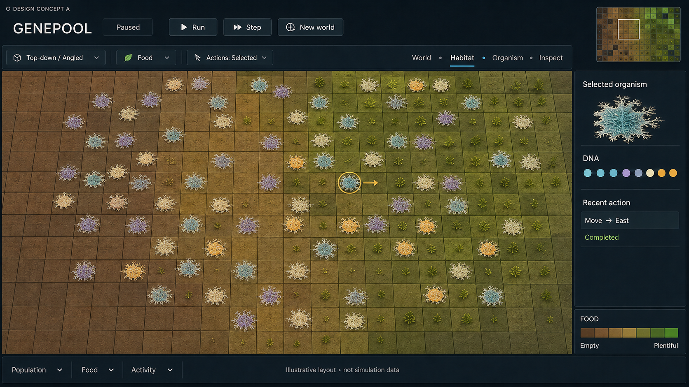

# R03 Step 4 — preferred organism appearance

Genepool Analyzer · 2026-09-08 · Owner visual preference, DEC-0029.

The owner requested a mould-like version of Concept A and positively reviewed the resulting image: “Yup this looks much much better. More like an organism, less like sentient rock :D”.

**Preferred direction:** flat, irregular mould-like patches with branching filaments, pale fuzzy edges, subdued depth and distinguishable organism colors. This replaces the rounded pebble/dome body direction in the earlier [Step 4 proposal](R03_STEP4_DESIGN_PROPOSAL.md). The earlier images remain comparison drafts. Board layout, food palette and four zoom bands remain under the broader design proposal; this response does not establish blanket acceptance or authorize implementation.

This is an appearance concept, not a change to movement, spreading, reproduction, occupancy, species, or the deferred food-growth cycle. Fine filaments should simplify at distant zoom levels, and individual occupied cells must remain distinguishable. Exact geometry, textures and performance require later implementation work.

The image was created with the built-in image-generation tool by editing the owner's attached Concept A view. The edit instruction preserved the interface, camera, food and organism positions while replacing smooth bodies and the inspector portrait with flat, irregular, softly textured colonies, asymmetrical lobes and branching filaments. The selected organism retains its amber indicator. It is not a production model or measured simulation screenshot.
