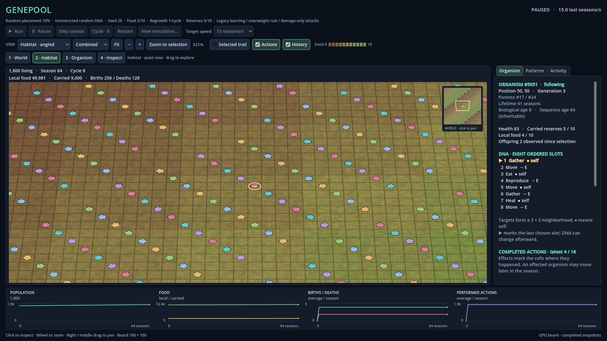

# R03 Step 4 — Perspective correction

Genepool Analyzer · 2026-09-08T09:43:48.412388+00:00 · **Implemented and verified, awaiting owner review.**

The owner approved a closer/wider front edge, farther/narrower back edge, receding grid and modest diagonal. This corrects the shortcoming in FACT-0057. Approval of that correction is DEC-0034; acceptance of the resulting implementation remains pending.

## Result

Habitat angled now uses an actual perspective camera, at 50° above the ground with an 18° diagonal orientation and a 40° fitted vertical field of view. At the tested fitted sizes the front edge is about 39% longer on screen than the back edge. Top-down remains an unskewed orthographic view. No new dependency, simulation rule, learning logic or random draw changed.

Picking, pointer-anchored zoom, right/middle drag, selection, action anchors, actual world borders and visible-cell filtering now follow the projected ground. The minimap draws the actual visible ground polygon. Zoom changes field of view while the camera distance keeps every board point in front; tight world-derived depth bounds prevent the almost coplanar organism and ground layers from fighting. All-visible muted L3 and focused-only L4 action scopes are retained.

These are actual renderer captures on a detached 1,800-organism synthetic review fixture, not generated mockups or ecological outcomes. Its run controls are disabled because it owns no simulation; normal startup retains live controls.

[Same fixture top-down](r03_perspective_topdown.png)

## Verification

- **Whole-solution Visual Studio 2022 Debug and Release builds: PASS**, 0 errors and the same106 existing CA1416 warnings. SDK/framework/project/solution settings unchanged.
- **GPU: 170 checks PASS**, including native-camera projection oracles, front/back ratios, receding rows, modest diagonal, all4 fit corners, clipping, native near/far picking, zoom/drag through Godot input, 80× maximum zoom, independent polygon culling, minimap footprint and near/far action pixels. Both1366×768 and1920×1080 exercised. No engine errors.
- **Headless: 145 checks PASS. Original2D/shared-controls GPU suite: 62 PASS.** Paused state and RNG passivity, same-run view switching, real worker step and shutdown passed.
- **Mould pixels:**72 visible samples across Habitat/Organism detail. Body area30.36–32.70% of projected cell,100% central-body coverage and minimum99.09% connected body. Readability thresholds were15–60% area,90% central coverage,85% connected mat. Exact fractions are in current GPU measurements.
- **Prior console regression evidence reused:**159/159 in each configuration. All five rebuilt non-Godot assembly SHA-256 identities match their passing Debug/Release reports. Those suites were not rerun for these Godot-only edits.
- Current benchmark repeat:12/12 checks PASS. Every workload delivered70/70 requested10Hz snapshots after3s warmup and7s measurement. GPU: AMD Radeon RX 6800; Godot 4.7.2-stable (official), Compatibility,1920×1080,60FPS cap.

| Population | Detail | Visible cues | Mean FPS | p95 frame interval | Maximum |
| --- | --- | --- | --- | --- | --- |
| 0 | L1 | 0 | 60.00 | 16.68 ms | 16.76 ms |
| 1,000 | L1 | 0 | 60.00 | 16.71 ms | 25.59 ms |
| 10,000 | L1 | 0 | 57.03 | 22.90 ms | 52.86 ms |
| 10,000 | L3 | 393 | 60.00 | 16.79 ms | 29.74 ms |

These are main-loop timings for detached snapshots, excluding simulation calculation and physical presentation latency. The first empty-board sample missed the33.3ms p95 gate; the controlled repeat passed, but variability remains unexplained. Therefore this is bounded passing evidence, not a guarantee of60FPS. Dense perspective L3 contains393 visible cues; the old orthographic benchmark contained364, so its timing is not an identical-workload optimization comparison.

## Failures and corrections retained

- **first_gpu**: Godot Fov property setter rejects below1deg at80x zoom, leaves40deg while cache advances; native-camera test detected divergence (509.99,414.02 cached vs752.92,319.20 native). Public SetPerspective applies complete camera projection; max80x native camera agreement passed on next run.
- **second_gpu**: Maximum-zoom native camera checks now pass. Injected middle-drag expected(753.64,321.56), observed(1193,149); investigate live input interleaving vs handler. Input test now flushes buffered events and delivers press/motion/release synchronously through the real Godot GUI route with temporary nonaccumulated input, restoring it afterward. A passive event observer proves all three intended local-coordinate events arrived. Original suspected OS-motion interleaving was not proven because the first attempt had no delivery log; native projection and 1.5px threshold unchanged. Subsequent GPU run passed.
- **visual_inspection_after_159_passes**: Actual angled Habitat screenshot showed many organism silhouettes as thin shards, including selected body almost absent. Existing angled pixel test only checked cues; body checks were top-down. Camera clip range bounded to the entire world with full height margin, rather than Near .01 and Far>=500. Rerender shows intact patches; 72 actual GPU colony samples across levels2/3 cover30.36–32.70% of cells, all central cores fully present and minimum99.09% connected mat. No shader, world layer height, or simulation rule changed.
- **first_final_perspective_benchmark**: 11/12 checks passed. Empty-board p95 frame interval33.6896ms missed33.3ms budget (55.95FPS); 1k/fulloverview/dense393cue cases ~60FPS and16.70–16.73ms p95. All cases delivered70/70updates without skips. No engineerrors. One quiet repeat passed12/12checks with all70/70updates delivered. Full overview57.03FPS,p9522.8957ms,max52.8587ms; dense393cue view60.00FPS,p9516.7932ms. Empty and1k samples passed. No code, threshold or workload changed. Web retrieval overlapped the initial empty-board sample, but its contribution was not measured; timing variability remains unexplained and the first miss is retained. No further reruns.

## Owner-supplied 2.5D demo

The [official C# demo README](https://raw.githubusercontent.com/godotengine/godot-demo-projects/master/mono/2.5d/README.md) links the exact Store page supplied by the owner. It describes2D sprites/camera,3D coordinates, fixed viewing bases, sorting and shadow placement. Its [Transform25D implementation](https://raw.githubusercontent.com/godotengine/godot-demo-projects/master/mono/2.5d/addons/node25d-cs/Transform25D.cs) uses a fixed linear coordinate mapping without perspective division. Inference: useful later for sprite, height and shadow ideas, but adopting that projection would not supply the requested near/far size difference. Keep the current Camera3D correction; retain this as a future visual reference. The Store page itself failed direct retrieval; its corresponding official sources were inspected on 2026-09-08T09:43:48.412388+00:00. No demo installed, executed or copied into the project.

## Scope, source horizon and review checkpoint

Base Git HEAD remains 14b39d984555897e88c279ed21651df7c114e05d. Previous Step4 edits were already uncommitted; they were preserved. Six changed registered predecessors have exact minimal in-KB snapshots because HEAD did not reproduce their registered bytes; two new source files and two official reference URLs are registered with this correction. A seventh initially safeguarded file was unchanged; its unused duplicate snapshot is removed only after exact comparison. Current source/artifact hashes and binary reuse evidence are recorded in FACT-0058.

The initial IMPROVEMENT_RESULT_R03_STEP4.md and its record assertions remain dated evidence; the runner replaces current report and preview files. FACT-0055/0056/0057 point to this correction. No historical test archive or whole-KB backup is created.

Open the entire Fistnet.Genepool.sln in VS2022 as usual, run the Godot viewer, choose Habitat angled, then compare Fit, Habitat and Organism; drag and select near/far organisms. F5 breakpoint interaction and physical monitor/DPI transitions were not newly tested. Owner visual acceptance remains pending. Step5, food cycle, exports and ecology remain outside this correction. No commit/push performed.
