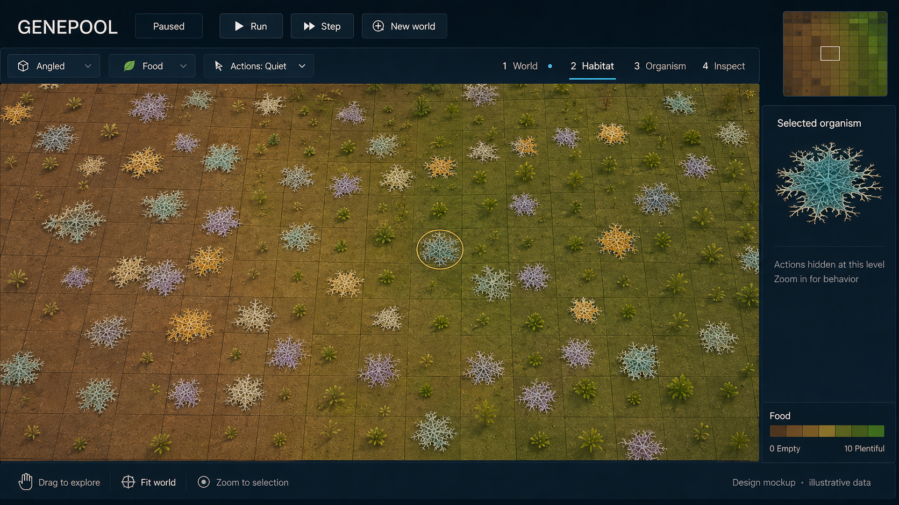
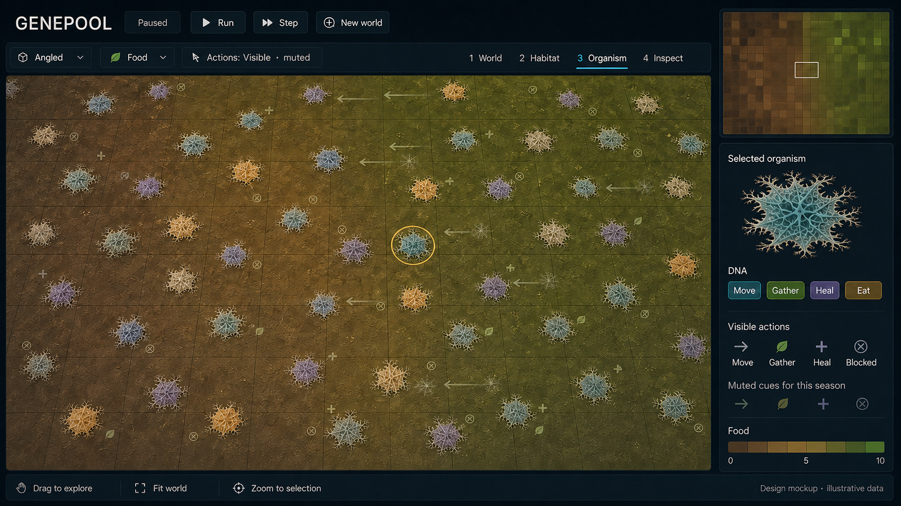
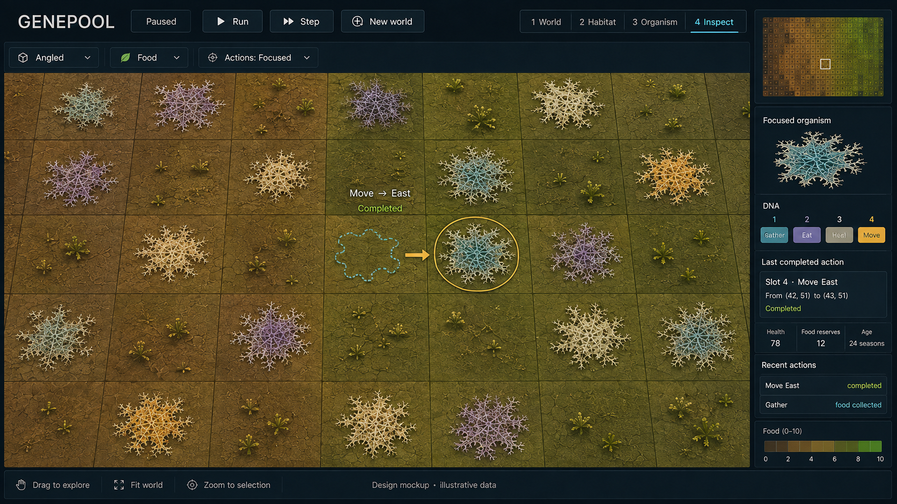

# R03 Step 4 — Updated visual review set

Genepool Analyzer · 2026-09-08 · **Design direction accepted by the owner (DEC-0031); implementation unstarted.**

Owner acceptance after reviewing this set: “Ok this looks good for now. We can improve on this later. Accepted. Whats next?” The mockups establish the current visual direction, with future refinement allowed. They do not establish implementation completion or measured rendering behavior.

Owner request: “Ok before i fully accept this proposal, draw out a few images so we can see what exactly are you planning.” This continues DEC-0028 design-only work. It does not accept the entire proposal or authorize coding.

This set illustrates [design revision 2](R03_STEP4_DESIGN_PROPOSAL.md), incorporating DEC-0029 mould appearance and DEC-0030 approved ground, continuous cropped views, muted visible-area actions at level 3 and full focused actions at level 4.

## Level 2 — Habitat



Quiet neighborhood view: readable mould silhouettes, dirt and grass, selected-organism locator, minimap and mouse-panning hint. No action overlay at this level. Terrain continues beyond the viewport; the apparent window edge is not a physical board rim.

## Level 3 — Organism



Small, subdued action glyphs distributed throughout the visible area. Leaf, plus, directional and blocked cues communicate real outcomes in the eventual renderer; empty inactive cells get no fabricated activity. The proposed event feed covers every visible action-bearing cell for the displayed season. This still image illustrates styling, not measured event coverage. Blocked is an outcome in the legend, not a DNA action. Final edit corrected the draft's reversed movement convention, DNA label and minimap rectangle size.

## Level 4 — Inspect



Only the focused cyan organism has full feedback. Its old-position outline is in the left cell; the solid body and selection ring are in the adjacent right cell, matching the inspector's completed Move East from (42,51) to (43,51). Other organisms remain visible without unrelated effects. Values are illustrative placeholders.

## Interpretation and review limits

These are generated appearance/layout studies, not screenshots of implemented software or three deterministic views of the same simulated state. Exact cell counts, filament shapes, minimap proportions and glyph placement are illustrative. The actual implementation must keep bodies within cells, derive each cue from actual outcomes and map the minimap to the real camera. The continuous crop and focus rules are the design contract; the mockups are not a substitute for implementation checks. Level 1 remains the quiet full-world distribution view in the main proposal.

No simulation/viewer source edits, builds, tests, dependencies or trials were performed. Existing VS2022 compatibility remains required. Deferred food growth mechanics remain deferred. Stop for owner visual review.

## Generation provenance and final prompt set

Tool: built-in image generation. Appearance reference: existing approved concept-d-mould.png. Three independent generation calls followed by one targeted consistency edit to the Organism image. Final outputs were visually inspected and copied into the project; previous concepts remain unchanged. Transient read-only reviewer supplied five checks for crop, scope, outcomes, inspector agreement and mould/ground appearance; Genepool Analyzer owns the final selection.

### Initial prompt 1 — Habitat

```text
Use case: ui-mockup. Produce ONE finished wide landscape 16:9 high fidelity Genepool simulation UI design mockup, not a collage. Input image is an APPEARANCE AND UI STYLE REFERENCE only: preserve its dark navy UI, approved earthy dirt-to-olive-to-green grass, and colourful flat mould colonies with fuzzy pale branching edges. This is a NEW Habitat zoom-level2 view. Keep organisms irregular flattened mycelium patches, not round pebbles, balls, eyes, tall mushrooms or spiky sea urchins. Mould has softly coloured teal, lavender, cream and ochre cores with delicate irregular roots; readable silhouettes, restrained detail at this scale.
Composition: top header GENEPOOL, Paused, Run, Step, New world. Second slim toolbar: 'Angled', 'Food', 'Actions: Quiet'; four tabs '1 World', '2 Habitat', '3 Organism', '4 Inspect', Habitat visibly active. Board occupies most of left 80 percent, inspector and minimap right 20 percent. One gently angled near-top-down orthographic continuous flat soil plane. Approx 24 columns by12 rows of visible cells, 45percent occupied, mixed organic food availability in natural patches, scattered sprouts where food plentiful. Cells run completely to and beyond all four edges of the board viewport, cutting partial cells/grass/mould naturally. The viewport is an INTERIOR crop of a 100x100 world, NOT a tiny entire board. NO raised edge, rim, cliff, black moat, horizon, island, outer stroke or drop shadow framing the ground. App panel divisions are fine, but the ground has no physical perimeter. Ground texture and grid continue beyond window on all sides. Thin internal seams, not heavy black checkerboard. No arrows or action glyphs on board in this quiet view. A cyan mould selected near center-right has a thin amber focus ring, no arrow.
Right top: small square full-world minimap of coarse brown/green pixels with a centered small viewport rectangle clearly well inside its boundary. Below 'Selected organism' and enlarged flat branching cyan mould preview, concise text 'Actions hidden at this level' and 'Zoom in for behavior'. Food legend bottomright labelled 'Food' '0 Empty' '10 Plentiful', brown to green. Bottom bar: 'Drag to explore' hand symbol, 'Fit world', 'Zoom to selection', and clear small caption 'Design mockup · illustrative data'. Typography crisp, readable, economical. Natural warm top lighting, restrained shallow 3D depth, not photoreal epic game. Preserve sense of a simple handsome simulation, no new features or biological rules.
```

### Initial prompt 2 — Organism

```text
Use case: ui-mockup. Generate ONE wide landscape 16:9 full application mockup for GENEPOOL zoom level3 Organism. The input image is the reference for established dark navy UI, brown/olive/green grass and dirt, irregular low flat pastel mould colonies with branching pale fuzzy margins. Not an edit of the reference's old action settings. Current design rules below supersede reference. NO pebble balls, circular glossy bodies, eyes, mushrooms, neon glow or tall geometry.
Header GENEPOOL, Paused, Run, Step, New world. Slim toolbar 'Angled' 'Food' 'Actions: Visible · muted'; four tabs '1 World', '2 Habitat', '3 Organism', '4 Inspect', with3active. Left80percent is continuous gently angled near-topdown flat orthographic ground, visible INTERIOR crop around12columns by7rows. Terrain naturally cut off by window, partialcells at every edge, no actual world edge anywhere. NO raised perimeter, cliff, bevel, black moat or isolated board island. Faint regular cellseams; warm brown bareearth blends with olive and green low grass. About40 assorted teal/lavender/ochre/cream irregular flattened mould bodies, each 55–70percent of cellwidth and inside its own cell. More branching detail than distant view.
Critical behavior: muted low-opacity small actionglyphs distributed THROUGHOUT the entire visible occupied area, not just near focus. Make action overlays much less visually dominant than mould. About half of bodies have a tiny simple leaf/mote for Gather; some tinyplus for Heal; several have faint short directional movement links with barely visible old-position ghost in adjacent now-emptycell and solid organism in ACTUAL destination; a few muted crossed target glyphs for blocked attempts with body remaining source. No giant animated trails, big damage numbers, dense floating text, selection beams or explosions. All cues are illustrative completed actions across one displayed season. Empty inactivecells have no inventedaction. Use very thin desaturated palegreen/cyan/amber marks; subtle but visible when examined. No large labels overboard. Focusring nearcenter is thin amber but doesnot monopolize feedback; unrelatedorganisms elsewhere stillhave mutedcues.
Right20percent: square full-world brown-green minimap with small highlighted viewport rectangle centered inside fullworld. Selected organism inspector with larger cyan mould, small 'DNA' row of compact labelled action chips, and text 'Visible actions' 'Muted cues for this season'. Compact legend with glyphs 'Move', 'Gather', 'Heal', 'Blocked'. Food brown→green0–10 legend. Footer 'Drag to explore', 'Fit world', 'Zoom to selection', 'Design mockup · illustrative data'. High quality legible polished mockup, clean enough to watch, no claims of real simulation results.
```

### Initial prompt 3 — Inspect

```text
Use case: ui-mockup. Create ONE wide landscape 16:9 Genepool full application mockup zoomlevel4 Inspect. Inputimage is UI/appearance reference only. Preserve dark navy UI, earthy brown→olive→green dirtandgrass, beautifully detailed FLAT irregular mould organisms: pale branching fuzzy mycelium edges withsoftly coloured cyan,lavender,cream,ochre texturedcores. More microscopic veining atthiszoom, restrained shallowheight, notbeads/pebbles/spheres/eyes/urchins/mushrooms.
Header GENEPOOL, Paused, Run, Step, New world. Toolbar 'Angled', 'Food', 'Actions: Focused'; tabs '1 World', '2 Habitat', '3 Organism', '4 Inspect' with4active. Mainleft75percent continuousflat ground viewed gentlyangled orthographic, about6columns by4rows visible, croppedpartialcells everyedge. This is interiorviewport oflarge100x100board, NOTawholeminiatureboard. NOphysicalrim,border,cliff,raisededge,bevel,moat,blackgap orhorizon aroundground. Faintcellseamscontinue beyondwindow. Richbrowndirtlowgrassandfoodpatches; around12distinctirregularmouldcolonies. Allbodiesvisible; ONLY ONE focused cyan organism gets ANY action feedback.
Very precise selected completed move demonstration nearcenter: two adjacentcells onSAMEgridrow. The LEFTcellcontains ONLYa faintdashedcyan irregular old-positionoutline (no solid organism), at itscellcenter. The immediatelyadjacent RIGHTcellcontains the ONEsolidfullcyan mould selectedorganism, withthinamberring. Ashort crispamber arrow points east LEFTtoRIGHT fromghostcenter tosolidbody, stopsatdestination. This isoneorganism thathasALREADYmoved, nottwobodies orafuturetarget. RingonSOLIDdestination ONLY. Smallclear labelabovethetwocells 'Move → East' and 'Completed'. Nootherarrows,healthbars,damage,plus,motes,ringsoractionlabels onanyotherorganism. Otherbodies arestill colourful visiblecolonyshapes.
Right25percent inspector: fullworldminimapbrown-green withtinysquareviewportwellinsideworld. 'Focused organism' with matching enlargedcyanflatmould preview. 'DNA' strip 4 compactchips '1 Gather', '2 Eat', '3 Heal', '4 Move'; highlight4. 'Last completed action' card text 'Slot 4 · Move East' 'From (42, 51) to (43, 51)' 'Completed'. Beneathclearvalues 'Health 78' 'Food reserves 12' 'Age 24 seasons', marked illustrative byfooter. Compact 'Recent actions' rows 'Move East — completed' and 'Gather — food collected'. Food brown→green0–10 legend. Footer 'Drag to explore' 'Fit world' 'Zoom to selection' and 'Design mockup · illustrative data'. This ispolished restrained simulation software, not AAAgame or scientificmeasurement. Crispreadabletype; focusdetailsclear butdonotobscureground.
```

### Final Organism consistency edit

```text
Use case: precise-object-edit. Edit this Level 3 Organism mockup, preserving all UI layout, typography style, ground, grass, colony appearance, colony positions, crop, subdued action coverage and colors. Make ONLY these consistency corrections: (1) Every directional movement arrow should end at a SOLID colony and originate from an EMPTY-cell faint ghost. In this image the thin arrows now point from solid left bodies to faint right ghosts; reverse those arrowheads to point LEFT from right ghost toward solid left body, without relocating bodies. This shows a completed westward move. Keep all movement cues just as faint and subdued as before. (2) In the inspector DNA chip row replace the word 'Blocked' with 'Eat'; Blocked is an outcome and should remain ONLY in the separate Visible actions legend. DNA row should read 'Move', 'Gather', 'Heal', 'Eat'. (3) Shrink the minimap viewport rectangle to about12percent of minimap width and8percent height, located in the middle, since this is a closer crop than Habitat. (4) If any plus or cross lies alone in an empty cell without associated actor, place it subtly beside the nearest body instead. Do not add new large labels, numeric overlays, physicalboardedges, neon, neworganisms or change selectedring. Keep the rest unchanged.
```
