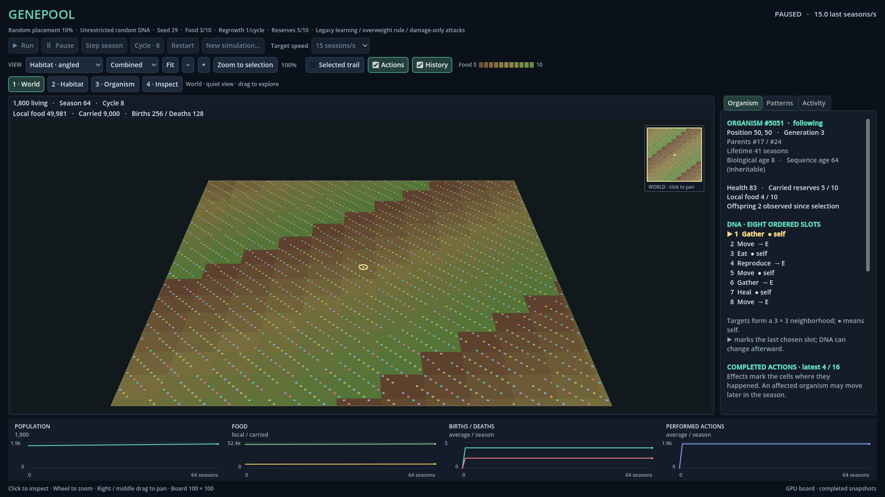
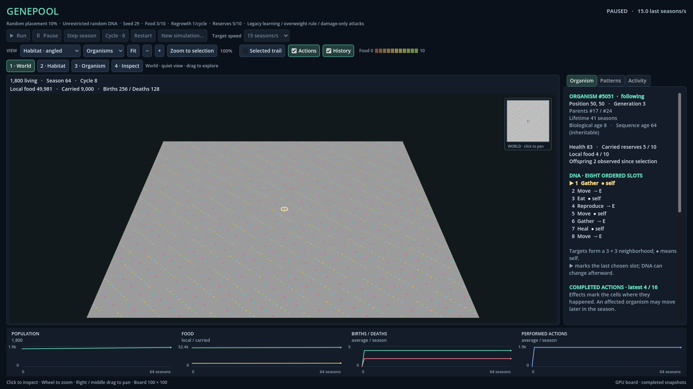

# R03 Step 4 — Trapezoid and Organisms ground refinement

Genepool Analyzer · 2026-09-08T10:48:27.554838+00:00 · **Implemented and verified; awaiting owner review.**

The owner requested light grey ground for the Organisms filter and supplied a red trapezoid reference showing a centred board with level back/front edges. This refines the earlier modest-diagonal direction in DEC-0034. The earlier brown-ground report remains resolved as a filter selection, not a reproduced restart bug (FACT-0059).

The Habitat angled camera now faces squarely across the ground: yaw 0°, elevation 34°, fitted vertical field of view 25.5°. Actual native-camera measurements at 1366×768 and 1920×1080 show front/back width ratios 1.631 and 1.641, and projected height/front-width approximately 0.45. Both edges are horizontal and horizontally centred. The geometry/navigation implementation and depth safeguards are retained.

Organisms-only Habitat ground is neutral light grey, including its minimap. Food and grass are hidden in that layer. Combined/Food retain the actual brown-to-green food display. The minimap uses a dark viewport outline and a dark halo around the selected point so navigation remains visible on grey. The earlier Original 2D renderer keeps its existing appearance.

These are actual GPU captures of the same detached 1,800-organism synthetic fixture and camera, not mockups or ecological results. Fixture controls are disabled because no simulation is attached; normal startup has live controls.

[Angled Habitat detail](r03_perspective_detail.png) · [Top-down comparison](r03_perspective_topdown.png)

Visual inspection found the intended shape and distinct grey ground with intact colonies and navigation. Pastel overview dots have lower contrast on grey, especially in the far rows; they remain discernible. The palette was retained, and visual acceptance remains the owner's decision.

## Verification

- **Whole solution built successfully with Visual Studio 2022 MSBuild in Debug and Release:** zero errors; the same 106 existing CA1416 warnings. No SDK, project, solution or dependency changes.
- **185 GPU checks passed**, including independent native-camera shape/picking/zoom/drag/clipping/culling, action anchors, colony body coverage, both sizes and actual grey pixels in angled/top-down. The same cells remain grey when food quantities swap; switching back to Combined restores brown/green. View switches preserve paused simulation state and RNG.
- **149 headless checks and 62 retained Original 2D/shared-control GPU checks passed.** All owned verification processes exited successfully without engine errors; live test workers shut down.
- Prior **159 console checks in each configuration** are reused after all five rebuilt non-Godot binary hashes match the passing reports exactly; those suites were not rerun for this visual-only refinement.
- **One renderer benchmark attempt, 12/12 checks passed**, on AMD Radeon RX 6800. Each case used 3 seconds warmup and 7 seconds measurement at 1920×1080, Compatibility renderer, 60 FPS cap, with all 70 requested 10 Hz snapshots delivered.

| Population | Detail level | Mean FPS | p95 frame interval | Maximum interval |
| --- | --- | --- | --- | --- |
| 0 | 1 | 60.00 | 16.68 ms | 16.73 ms |
| 1,000 | 1 | 60.00 | 16.72 ms | 32.60 ms |
| 10,000 | 1 | 60.00 | 16.75 ms | 24.91 ms |
| 10,000 | 3 | 60.00 | 16.69 ms | 28.12 ms |

These are main-loop observations of detached frames; they exclude simulation calculation and physical presentation latency. The new close-view footprint has 258 visible cells/cues, versus 393 in the previous camera measurement. This is bounded current performance evidence, not an equal-workload speedup claim or a guarantee of constant frame timing. Prior perspective failures/interventions remain in FACT-0058 and R03_STEP4_PERSPECTIVE_RESULT.md; no failed build/test/benchmark occurred in this refinement.

## Scope and evidence

Six current registered sources changed: camera pose, board ground colour, minimap, camera/pixel verification, one explanatory test comment, and viewer README. Their exact uncommitted predecessors were preserved as minimal KB source snapshots. No simulation source, rule, RNG, food cycle, tools or governance changed. Existing uncommitted Step 4 work was retained. Base Git HEAD: 14b39d984555897e88c279ed21651df7c114e05d; no commit or push performed.

Current report/capture files are deliberately replaced by the verification runner; dated earlier record assertions remain historical. FACT-0060 holds current source/artifact hashes and result locators. The KB transaction is revision/hash-bound and deep validation follows apply. The longstanding unavailable exact SRC-0115 historical bytes remain an explicitly disclosed warning, unrelated to this correction.

Open Fistnet.Genepool.sln in Visual Studio 2022, rebuild Debug and launch the Godot viewer. Compare Habitat angled at Fit, then Organisms and Combined, and zoom/drag/select. IDE breakpoint interaction and physical monitor/DPI transitions were not newly tested. Stop for owner review; Step 5, exports, food-cycle changes and ecology remain deferred.
