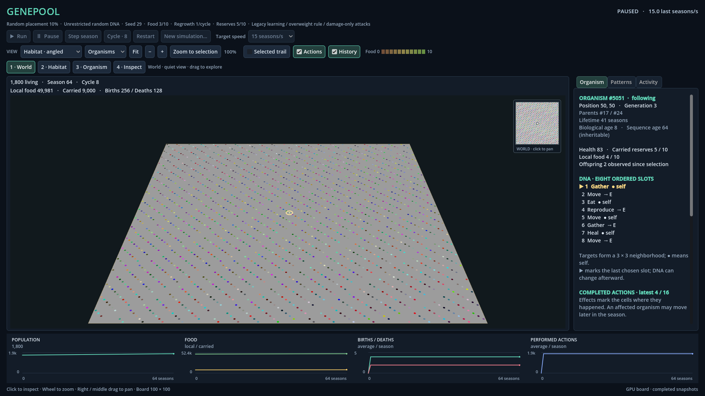
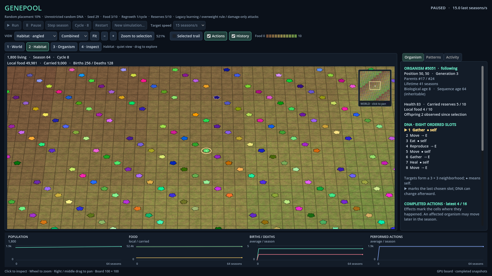
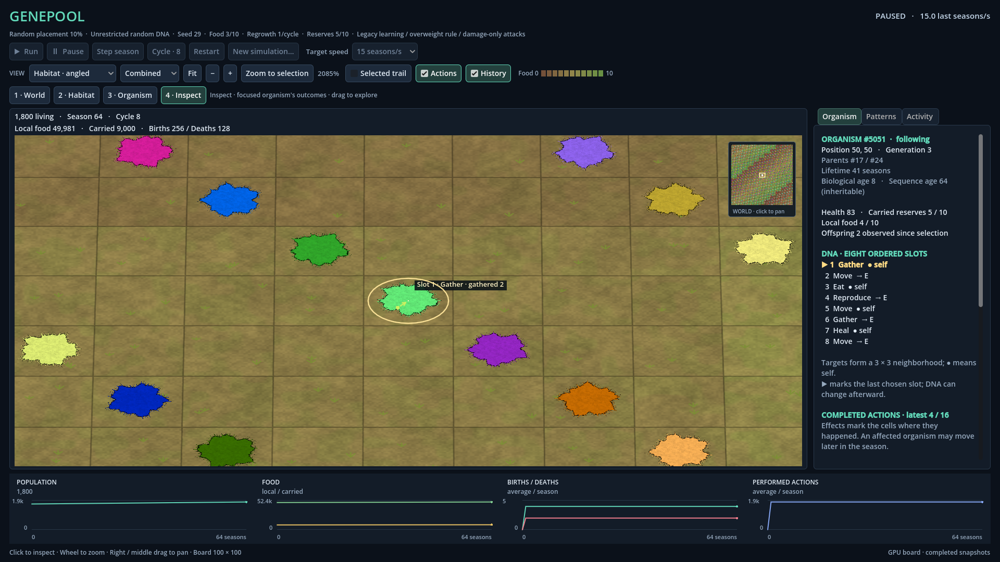

# Owner acceptance and closure — 8 September 2026

**R03 Step 5 is accepted and closed by the owner (DEC-0039).** This completes the five planned R03 milestones. Full DNA RGB and borderless World/View 1 organisms are included in the accepted result.

The owner next requests a planning-only proposal for VS2026/.NET10 and full 3D visuals (DEC-0040; REC-0012). No R04 implementation has started. The earlier pending-review statements below are retained as dated history; this acceptance supersedes only their review status. No tests were rerun for closure.

---

# View 1 outline adjustment — current update

Genepool Analyzer · 2026-09-08T11:51:00.278436+00:00 · **Implemented; awaiting owner review.**

Owner DEC-0038 requests no black organism border at View 1. World now disables the organism contrast-outline blend throughout the entire View 1 zoom range (projected cell size below 12 pixels). Views 2–4 retain their existing outline, body colour, shape and texture. The selection indicator and real board boundary are unaffected.

The whole solution rebuilt successfully with Visual Studio 2022 in Debug, with zero errors and the existing platform warnings. The actual GPU suite passed **217/217 checks**, with no engine errors. Its previous World contrast requirement depended on the now-unwanted outline; it was intentionally replaced before evaluation by borderless RGB pixel checks. Closer-view visibility and body-colour checks remain in place. A ground-matching organism can blend into the ground at World scale by design.

Current screenshots below were refreshed by this GPU run. Prior Release, headless, shared-control and benchmark results are dated evidence from FACT-0061, not repeated runs of this adjustment. The small shader change does not alter project settings or simulation code. Step5/R03 acceptance remains pending.

---

The initial Step5 result below is retained as dated history. Its outline description and old current-report hashes are superseded by FACT-0062 for this adjustment; the shared current screenshot/report paths now show the updated run.

# R03 Step 5 — Full RGB graphics polish

Genepool Analyzer · 2026-09-08T11:25:14.948365+00:00 · **Implemented and verified; awaiting owner review.**

The owner accepted and closed Step4 (DEC-0036) and directed continuation to Step5, the last milestone in the original five-step R03 outline. The owner then explicitly requested the full RGB spectrum used by the old WinForms view (DEC-0037), replacing the analyst's initial small-palette idea. R03 overall closure remains pending owner review.

## Result

Habitat and its minimap now use each snapshot cell's original 24-bit RGB colour directly, with opaque alpha. The seven pastel groups and pattern-hash replacement are removed. Dna.Common.GetOrganismColors and ViewCollector.PatternCode both pack eight ordered DNA action types, three bits each; directions and learned preferences are not included. Full RGB includes legitimate white, grey and pale DNA colours too: there is no forced pastel recolouring or quantization.

The flat mould material retains the supplied body hue and stable identity-based irregular silhouette. A contrasting edge separates dark or ground-coloured organisms without replacing their interiors. Close views use a thin fringe; the overview edge follows screen-pixel size. At the smallest scale the edge and body share pixels, so colour is clearer after zooming in. World-level display footprint increases from .64 to .88 cell width, improving distant visibility; close views retain their existing .92 footprint. Screen derivatives support antialiasing across depth. The former near-white rim treatment is removed. Pattern filtering derives the edge from original RGB and then dims the whole body/edge together, avoiding a bright-outline reversal.

WinForms historically lifts pure black to grey against its black background; Habitat preserves a black interior and gives it a visible edge. Inspector and README explain the actual DNA colour mapping. The accepted grey ground, dirt/grass shader, trapezoid camera, navigation and L3/L4 action rules are retained. No simulation rule or random draw changed.

## Verification

- Whole solution rebuilt with Visual Studio 2022 MSBuild, Debug and Release: zero errors, the same 106 existing CA1416 warnings. Project/SDK/solution settings unchanged.
- **215 GPU, 153 headless, and 62 Original2D/shared-control checks passed**, with zero engine errors. Coverage includes actual camera/input/passivity, RGB conversion, representative colour readability and body/outline highlighting. Detailed sample counts, criteria and measurements are in the current GPU report.
- Earlier 159 console checks per configuration reused only after exact identity match of all five rebuilt non-Godot assemblies. They were not rerun for this Godot-only graphics change.
- **12 benchmark checks passed** on AMD Radeon RX 6800,1920×1080 Compatibility renderer,60FPS cap. Four detached-frame workloads,3s warmup/7s measurement each; current delivery and timing values below.

| Population | Detail | Mean FPS | p95 frame interval | Maximum |
| --- | --- | --- | --- | --- |
| 0 | 1 | 60.00 | 16.69 ms | 16.83 ms |
| 1,000 | 1 | 60.00 | 16.69 ms | 25.59 ms |
| 10,000 | 1 | 60.00 | 16.69 ms | 22.22 ms |
| 10,000 | 3 | 60.00 | 16.69 ms | 28.32 ms |

These are bounded main-loop observations, excluding simulation calculation and physical display latency. They do not guarantee constant frame timing or ecological outcomes. The runner replaces current test reports and previews; prior records preserve dated results.

## Review and evidence

Current Step5 screenshots use synthetic detached RGB fixtures for visual comparison, not ecological trials. Their exact identities and those of reports/binaries are retained in FACT-0061. Actual sample-based checks support the exercised colours/backgrounds and views; they are not an accessibility certification or proof of every possible pixel arrangement. Owner visual acceptance, IDE breakpoint interaction and physical monitor/DPI transitions remain unverified here.

The first GPU evaluation passed 211 of 215 checks. Four overview visibility checks failed because colours matching the ground had a subpixel boundary. The implementation now uses a stronger, screen-sized edge at overview scale; all 215 checks passed on the subsequent run with the original contrast criteria unchanged. Source review also corrected the highlight-edge treatment before evaluation. The initial seven-colour proposal was replaced by the owner's explicit RGB instruction before GPU evaluation. These interventions are retained in FACT-0061.

### Current rendered examples

These captures use the same synthetic colour fixture. They show actual Godot output.

[World overview on grey ground](r03_step5_overview.png)

BaseGitHEAD 14b39d984555897e88c279ed21651df7c114e05d. Existing Step4 changes retained; no commit/push. Only affected registered predecessors have exact minimal KB history snapshots. KB verification retains the existing unavailable exact SRC-0115 historical-byte warning.

Review the Godot viewer from Visual Studio2022 as usual, compare Combined/Organisms at World and Habitat zoom, and select/highlight a pattern. Step4 remains owner accepted. Step5 and overall R03 closure await the owner's decision. Deferred food-cycle mechanics, exports and ecology remain outside this graphics pass.
